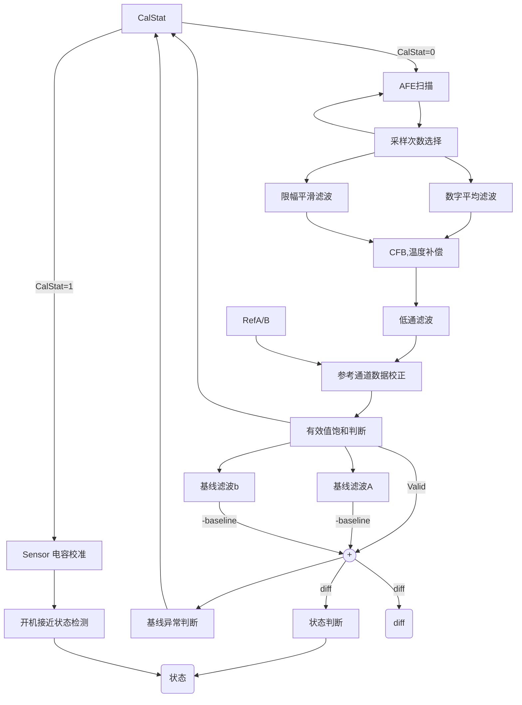

# 一级标题
## 1.1
### 1.1.1

# 2
## 2.2
### 2.3

```mermaid
graph TB
    A[CalStat]--CalStat=1--> B[Sensor 电容校准];
    B --> C[开机接近状态检测];
    A[CalStat]--CalStat=0-->afe[AFE扫描]-->D[采样次数选择];
    D-->afe & E[数字平均滤波] & F[限幅平滑滤波];
    E & F --> G[CFB,温度补偿]-->H[低通滤波];
    H-->I[参考通道数据校正]-->K[有效值饱和判断]-->A;
    J[RefA/B]-->I;
    K--Valid-->add((+));
    K--> blfa[基线滤波A] & blfb[基线滤波b] -->|-baseline| add;
    add --> L[基线异常判断]-->A;
    add--diff-->M[状态判断] & diff(diff);
    M & C --> N(状态)
```